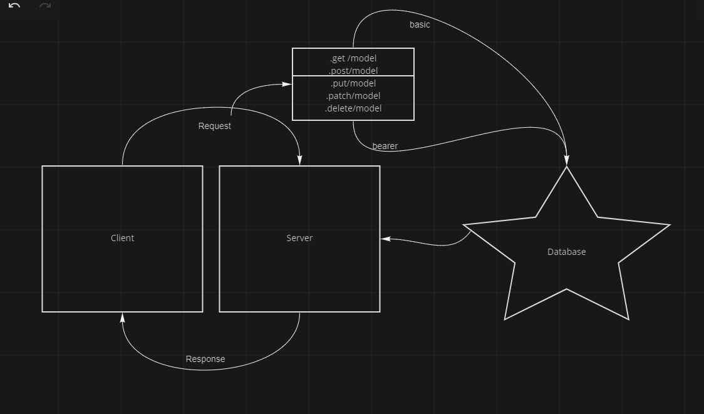

# auth-api

## Lab 8

## Author
J. Matt Miguel

### Collabrators
Michael Metcalf, Taylor Thorton (TA)

## Deployed link

https://auth-api-jamiguel23.herokuapp.com/

## setup

.env requirements

  - PORT
  - SECRET = 'secretstring'

## Endpoints

"Access Controll Lab08"

.get /
Mainpage hit

.post /signup
Post user and password to database

.post /signin
Post a success if login is valid

.get /users
Gets all users using token

Models: food and clothes

.get /api/v2/<modelName\>
User can access

.post /api/v2/<modelName\>
Writer can access

.put /api/v2/<modelName\>
Editor can access

.delete /api/v2/<modelName\>

## UML

